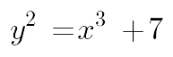
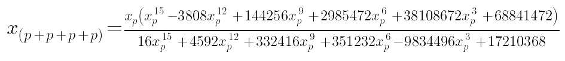
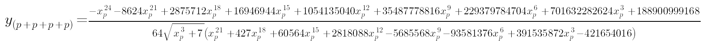
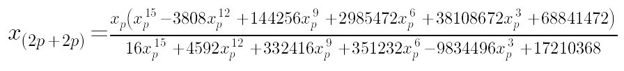
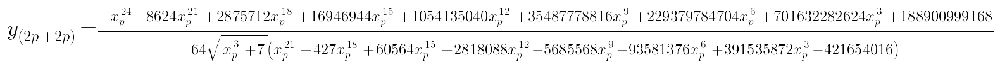

# visual secp256k1

visualise operations on the secp256k1 (bitcoin) elliptic curve

**this project is intended purely for understanding concepts. do not use it for
live crypto applications**

run like so:

    ./main.py -m

to generate this git markdown file and images. run without the `-m` (markdown)
flag to step through the tutorial image by image using matplotlib (enables
zooming) in your shell.

1. [point addition (infinite field)](#1-point-addition-infinite-field)
2. [subtraction and halving (infinite field)](#2-subtraction-and-halving-infinite-field)
3. [point addition (finite field)](#3-point-addition-finite-field)
4. [subtraction and halving (finite field)](#4-subtraction-and-halving-finite-field)
5. [bitcoin deterministic keys](#5-bitcoin-deterministic-keys)
6. [signing a message](#6-signing-a-message)
7. [verifying a message signature](#7-verifying-a-message-signature)
8. [recovering a public key from a signature](#8-recovering-a-public-key-from-a-signature)
9. [cracking a private key](#9-cracking-a-private-key)

the equation of the bitcoin elliptic curve is as follows:

this equation is called `secp256k1` and looks like this:

### 1. point addition (infinite field)

to add two points on the elliptic curve, just draw a line through them and find the third intersection with the curve, then mirror this third point about the `x`-axis. for example, adding point `p` to point `q`:

note that the third intersection with the curve can also lie between the points being added:

try moving point `q` towards point `p` along the curve:

clearly as `q` approaches `p`, the line between `q` and `p` approaches the tangent at `p`. and at `q = p` this line *is* the tangent. so a point can be added to itself (`p + p`, ie `2p`) by finding the tangent to the curve at that point and the third intersection with the curve:

ok, but so what? when you say 'add points on the curve' is this just fancy mathematical lingo, or does this form of addition work like regular addition? for example does `p + p + p + p = 2p + 2p` on the curve?

to answer that, lets check with `p` at `x = 10` in the top half of the curve:

notice how the tangent to `2p` and the line through `p` and `3p` both result in the same intersection with the curve. lets zoom in to check:

ok they sure seem to converge on the same point, but maybe `x = 10` is just a special case? does point addition work for other values of `x`?

lets try `x = 4` in the bottom half of the curve:

so far so good. zooming in:

cool. lets do one last check using point `x = 3` in the top half of the curve:

well, this point addition on the bitcoin elliptic curve certainly works in the graphs. but what if the graphs are innaccurate? maybe the point addition is only approximate and the graphs do not display the inaccuracy...

a more accurate way of testing whether point addition really does work would be to compute the `x` and `y` coordinates at point `p + p + p + p` and also compute the `x` and `y` coordinates at point `2p + 2p` and see if they are identical. lets check for `x = 10` with y in the top half of the curve:

`p + p + p + p = (-25983597172720/20434333412807, 205390966891466617199*sqrt(1007)/2931267467590684346699)`

`2p + 2p = (-25983597172720/20434333412807, 205390966891466617199*sqrt(1007)/2931267467590684346699)`

cool! clearly they are identical :) however lets check the more general case where `x` at point `p` is a variable in the bottom half of the curve:

at `p + p + p + p`, `x` is computed as:

and `y` is computed as:

at `2p + 2p`, `x` is computed as:

and `y` is computed as:

compare these results and you will see that that they are identical. this means that addition and multiplication of points on the bitcoin elliptic curve really does work the same way as regular addition and multiplication!

### 2. subtraction and halving (infinite field)

just as points can be added together and doubled and on the bitcoin elliptic, so they can also be subtracted and halved. subtraction is simply the reverse of addition - ie if we add point `q` to point `p` and arrive at point `r` then logically if we subtract point `q` from point `r` we should arrive back at `p`: `p + q = r`, therefore (subtracting `q` from both sides): `p = r - q`. another way of writing this is `r + (-q) = p`. but what is `-q`? it is simply the mirroring of point `q` about the `x`-axis:

clearly, subtracting point `q` from point `r` does indeed result in point `p` - back where we started.

so if subtraction is possible on the bitcoin elliptic curve, then how about division? well we have already seen how a point can be added to itself - ie a doubling (`p + p = 2p`), so the converse must also hold true. to get from point `2p` back to point `p` constitutes a halving operation. but is it possible? while it is certainly possible to find the tangent to the curve which passes through a given point, it must be noted that there exist 2 such tangents - one in the top half of the curve and one in the bottom:

this means that it is not possible to conduct a point division and arrive at a single solution on the bitcoin elliptic curve. note that this conclusion does not apply to elliptic curves over a finite field, as we will see later on.

--------------------------------------------------------------------------------

### 3. point addition (finite field)

### 4. subtraction and halving (finite field)

### 5. bitcoin master public keys

### 6. signing a message

### 7. verifying a message signature

### 8. recovering a public key from a signature

### 9. cracking a private key

